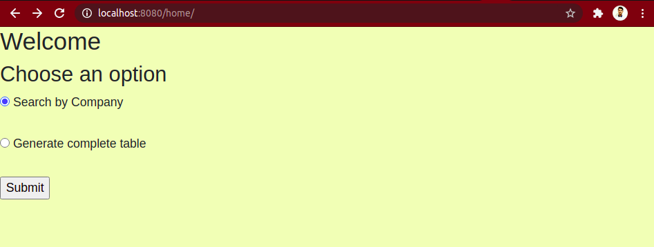
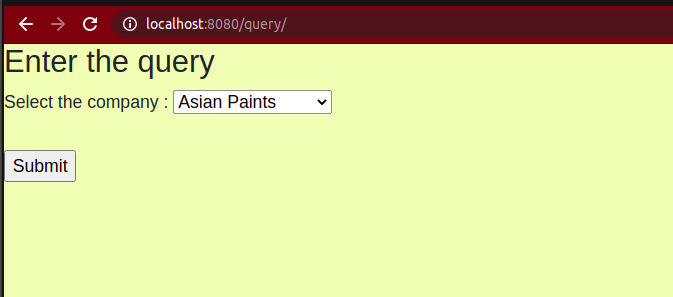
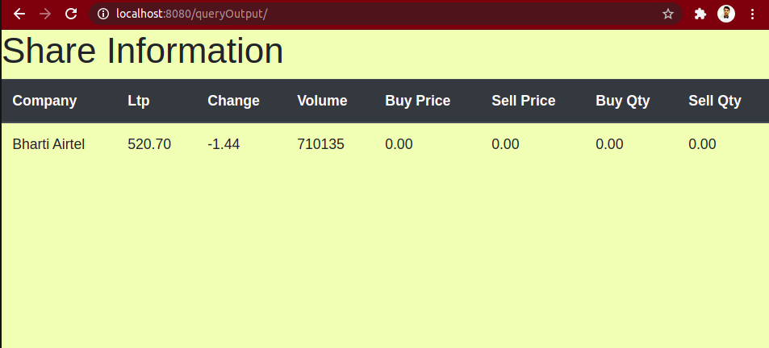
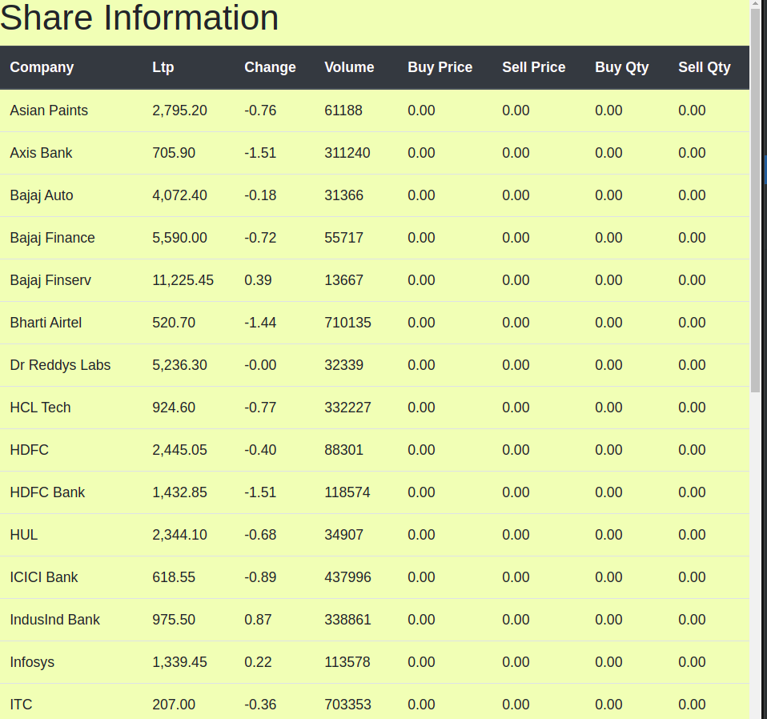

This project has been submitted as a part of assignment 4 for Distributed System course by Ashutosh Rajput (CS17B007)

Description:
The project scraps live shares data from https://www.moneycontrol.com/markets/indian-indices/

The data is presented in two forms : 1. Complete data (all shares togethers)
                                     2. Particular share data based on user input
                                
Steps to Run the program:
1. Execute scraper.go to scrap the data from the website. 
            "go run scraper.go"
   The data will be stored in sql database live_shares.db 
2. Execute handler.go to start the server 
            "go run handler.go"
3. Navigate to "localhost:8080/home/"
   You can select how you want the output.
   
4. If a particular share is required, then the user is asked to select the company name from the dropdown bob.
    
5. The particular company details are presented to the user.
   
6. If complete output option is chosen, a table of all  companies is presented to the user.
   